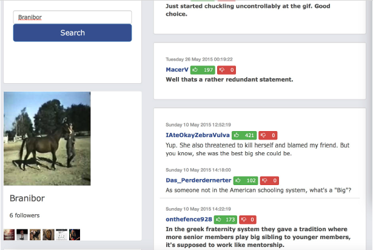
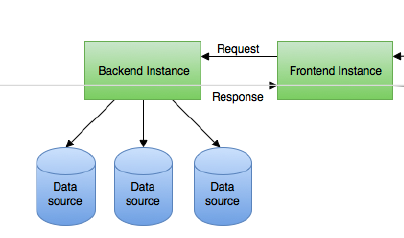

# Social Networking Timeline with Heterogeneous Backends

**Background**: A single HTTP request to retrieve and display a page in a social network may trigger a large number of subsequent requests and database actions at the back-end. It does not make sense to store all the data in the same manner considering the heterogeneity of data we have. 

**Objective**: Build different back-end systems for a social network application, supporting user profile check, user activities' track, and some data analytics.

**Main Functionalities**:

1. Show user's profile after he/she logged in
2. Search a user's followers and his/her comments
3. In-memory cached timeline for "top user" who has more than 300 followers

**Interim Screenshots (Not Official Final Version)**

# Architecture

| Dataset           | Data Store Type | Data Format                                                  |
| ----------------- | --------------- | ------------------------------------------------------------ |
| Login Information | RDBMS           | [userId, password, profileImageUrl]                          |
| Relations         | Graph DB        | [Followee, Follower]                                         |
| Comments          | Document DB     | JSON - {"cid":"", "parent_id":"", "uid":"", "timestamp":"", "content":"", "category":"", "ups":"", "downs":""} |
| Profile Images    | Amazon S3       | URLs                                                         |

## Role - Back-end Engineer

The web server used is **undertow**.

Main servlets implemented:

* Cache.java (HashMap<String, String> - (uid, info in JSON))
* FollowerServlet.java
* HomepageServlet.java
* ProfileServlet.java
* TimelineServlet.java
* TimelineWithCacheServlet.java