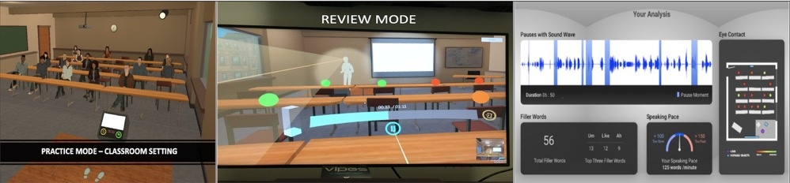
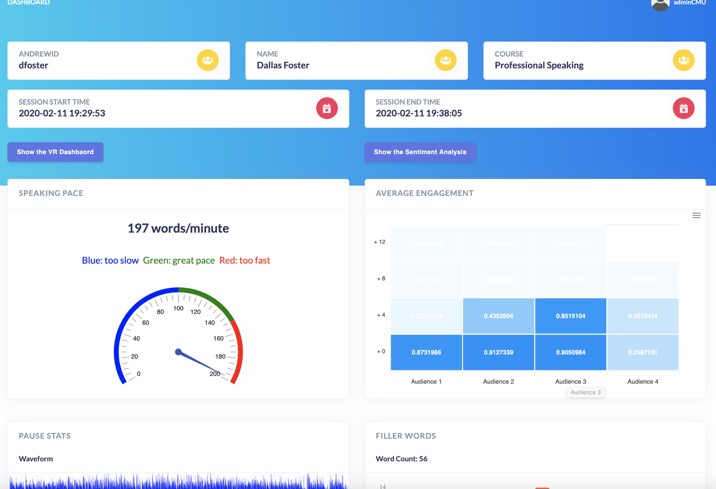
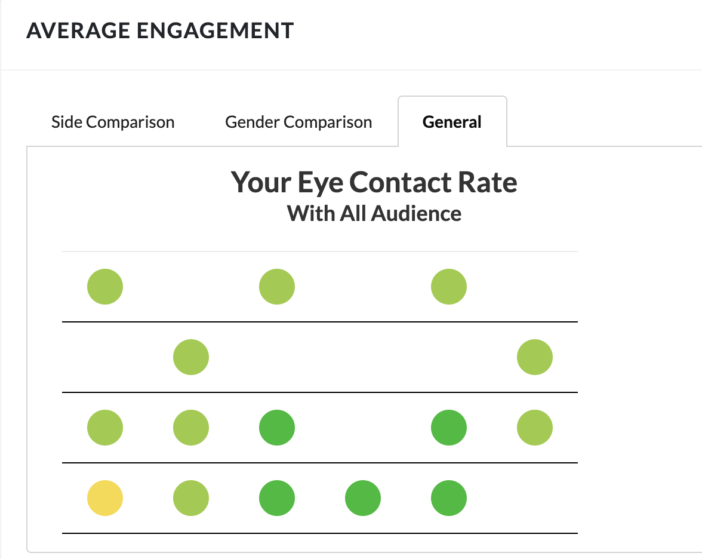
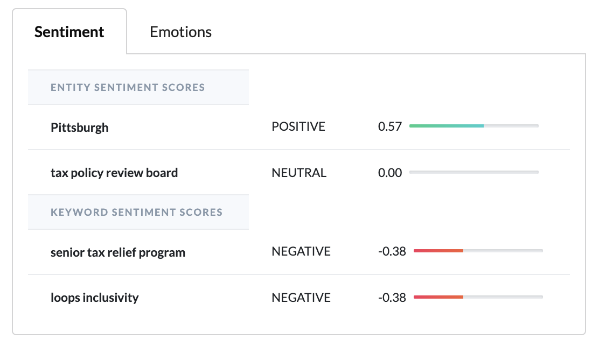
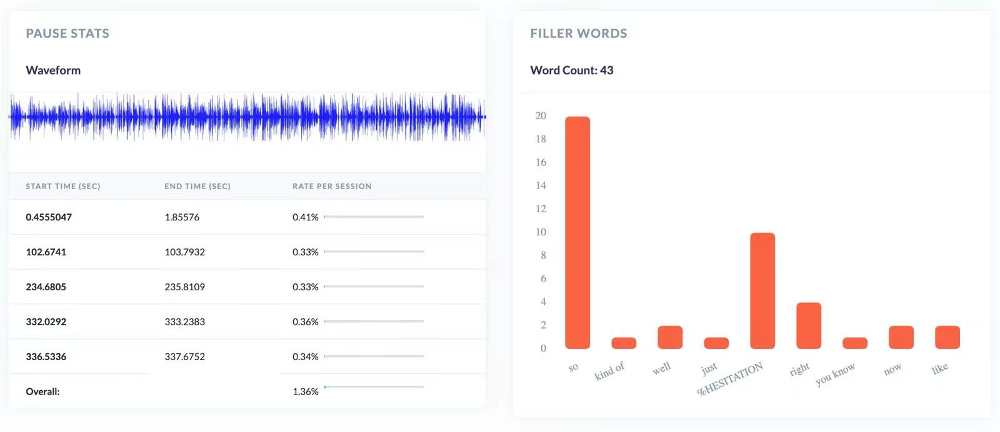
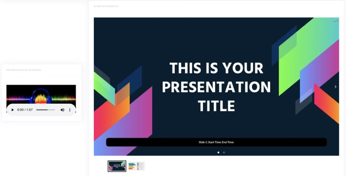

# HyattVRApp - Web

**Background**: VR Lab hosts an Oculus Headset which students can use to practice public speaking skills. In practice mode, students will be immersed in a VR enviornment with fifteen virtual audiences. At the end of the practice, students are able to check the data analysis including his/her count of filler words, speaking pace, eye contact, and sentiment analysis.

**Objective**: There is one drawback of the VRApp itself - users can only review the data analysis in our lab's computer and only after finishing one practice session. Therefore, we decided to build a web application to migarate all data and visualize them, so that students along with teachers can check any practice session's data anytime and anywhere.

**Main Functionalities**:

1. Navigate records by time or student name
2. Data analysis dashboard for each practice session
   - Speaking Pace (gauge char)
   - Eye Contact (customized line and circles)
   - Pause Stats (waveform and calculated data)
   - Filler Words Count (line chart)
   - Swipeable Slides
   - Sentiment and Emotion Analysis
3. Comparison between different sessions of specific students
4. Simple Comment for teachers

**Interim Screenshots (Not Official Final Version)**

# Architecture

## Role - The ONLY Front-end Engineer

The library used for front-end is **React**.

Project is created with:

* npm: 6.9.0
* React version: 16.13.1
* Webpack: 4.43.0
* Node.js: 14.4.0
* Port 8084 exposed
